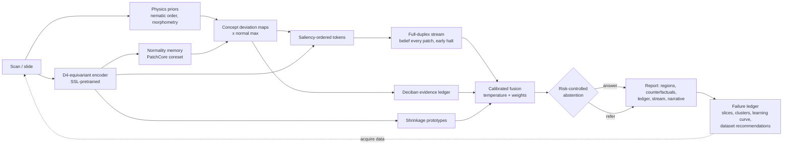

# OncoPattern

**Pattern-level, explainable, data-efficient cancer image analysis.**

It finds deviations from normal tissue down to a single misaligned or
atypical cell, highlights where they are, explains why in exact numeric
terms (including the evidence it weighed and discounted), gives a calibrated
percentage, and **abstains instead of guessing** when it cannot meet a
certified error bound. Every failure feeds a loop that says which data to
acquire next.

> ⚠️ Research software. Not a medical device, not validated on patients, not
> for clinical use. All results below are on procedurally generated
> *phantoms* with exact ground truth. They show that the machinery works, not
> that it is clinically accurate. See [ROADMAP.md](ROADMAP.md) Phase 10 for
> real-data validation.

**Two tracks live in this repository:**

* **Track B, the General Pattern Model (GPM)** in `oncopattern/gpm/`: a
  from-scratch, general-purpose transformer. **It is not a classifier.** Text
  and image patches share one token stream, and every task (detect, locate,
  measure, count, compare scans over time, describe, *decline to answer*) is a
  prompt with a text answer. It learns tissue "grammar" by predicting hidden
  patches, so its surprise at a patch is a label-free anomaly map (like a code
  model flagging an unlikely token). Its answers are graded by deterministic
  verifiers (like unit tests for code). It learns **what healthy anatomy looks
  like from healthy scans only**, builds a normative atlas, and explains a
  scan by redrawing the abnormal region as healthy and showing how the
  answer changes ([docs/GPM.md](docs/GPM.md#knowing-what-healthy-looks-like-the-normative-atlas-gpmnormativepy)).
  Sizes run from 2.0M to 7.15B
  parameters; about 88M is the right size for Kaggle's 2x T4. See
  [docs/GPM.md](docs/GPM.md) and [kaggle/README.md](kaggle/README.md).
* **Track A, the explainable pipeline** (the rest of `oncopattern/`):
  deciban evidence ledgers, counterfactual regions, certified abstention and
  the failure loop. GPM reuses these tools as its verifier and calibration layer.

### Track B: first measured results (tiny 2M model, 3,000 steps on a laptop CPU, synthetic data)

"Baseline" is the best *constant* answer, i.e. what a model that ignores the image would score. Verifier
reward in [0, 1], 40 held-out examples per task
([raw results](docs/examples/gpm_tiny_cpu_eval.json)):

| Task (all asked as free-text prompts) | GPM | Constant-answer baseline | Learned? |
|---|---|---|---|
| MRI: "Is there a mass lesion?" | **1.00** | 0.53 | yes |
| MRI: "Has the lesion grown?" (two scans, months apart) | **0.85** | 0.55 | yes |
| MRI: "Locate the lesion." (box tokens, IoU) | **0.61** | 0.48 | partly |
| Tissue: "Measure nuclear enlargement / misalignment ..." | 0.65 | 0.57 | slightly |
| Tissue: "Which pattern is present?" (4 single-cell patterns) | 0.18 | 0.38 | **no** |
| Tissue: normal? / locate / describe / count | = baseline | | **no** |
| Label-free surprise map: abnormal vs normal tissue image (AUROC) | 0.85 | 0.50 | yes, with no labels |

What this does and does not show: the architecture learns radiology-scale
detection, grounding and change-over-time from scratch, and its own
masked-patch surprise flags abnormal tissue with no labels. It does **not**
yet learn single-cell patterns at 2M parameters and about 48k examples; the
Track A pipeline does those at 90-97% on the same phantoms. Whether the
88M `base` model learns them on Kaggle is the next experiment
([ROADMAP](ROADMAP.md) G7), not a claim. None of this is evidence on real patients.

### Track A pipeline



## Quick start

```bash
pip install -e .            # numpy, scipy, torch (CPU is fine)
pip install -e ".[io,dev]"  # + DICOM/NIfTI/PNG readers and pytest

python -m oncopattern demo --quick          # every phase end to end, about 1 minute
python -m oncopattern demo                  # larger run, about 2 minutes
python -m pytest                            # 42 tests, about 3 min

python -m oncopattern gpm-plan --gpu t4 --n-gpus 2 --hours 30        # what size fits your GPUs
python -m oncopattern gpm-train --preset tiny --steps 3000           # train GPM from scratch (CPU ok for tiny)
python -m oncopattern gpm-eval --model outputs/gpm/model.pt          # grade every task with the verifier
python -m oncopattern gpm-ask img.png "Locate the most abnormal cells." --model outputs/gpm/model.pt
python -m oncopattern gpm-atlas --model outputs/gpm/model.pt --source phantom_mri --out atlas.pt   # healthy atlas
python -m oncopattern gpm-explain scan.png --model outputs/gpm/model.pt --atlas atlas.pt --out why.html

python -m oncopattern analyze slide.png --model outputs/demo/tissue/model.pt --out report.html
python -m oncopattern catalogue --organ lung --longitudinal
```

The demo writes to `outputs/demo/`:

* `tissue/reports/*.html`: case reports (failures first) with image, overlay, regions, ledger, stream and narrative
* `tissue/metrics.json`, `tissue/failure_report.json` (slices, clusters, learning curve, data recommendations), `tissue/regression_suite.json`
* `mri_longitudinal/longitudinal.json` and one report per timepoint: a head-MRI lesion appearing and growing over 24 months

Example reports are committed in [`docs/examples/`](docs/examples).

## What is new here

Twelve ideas borrowed from other fields, each implemented and tested. The
full mathematics is in [docs/INNOVATIONS.md](docs/INNOVATIONS.md).

| Borrowed from | Used for |
|---|---|
| Full-duplex speech (Moshi) + early-exit LLMs (CALM) | Belief is emitted after every patch; reading stops once the answer is settled |
| Factory defect inspection (PatchCore) | Learn *normal* only; flag anything unlike it, even unseen patterns |
| Liquid-crystal physics (nematic order) | Detect a single nucleus pointing against the tissue flow, with no training |
| Group-equivariant CNNs (symmetry physics) | Exact rotation/mirror invariance, 8x data efficiency per weight |
| JEPA / SimSiam / VICReg | Learn from unlabelled images |
| Stein's paradox / Bayesian shrinkage | Stable classes from 3-12 labelled examples |
| Turing & Good's weight of evidence | Exact deciban decomposition: supporting, outweighed, set aside |
| Conformal prediction / Learn-then-Test | Certified error bound on answered cases; abstain otherwise |
| Test-driven engineering + scaling laws | Failures become tests; power-law fits say how much data is needed |
| Kalman filter / CUSUM | Growth rate with uncertainty, earliest change alarm across scans |
| LoRA | Adapt to a new site or cancer type with about 10x fewer trainable parameters |

## Results on phantoms

Default demo (`python -m oncopattern demo`, seed 0): 4 tissue patterns, **12
labelled examples per pattern**, 80 normal tiles, 160 test cases. It runs in
about 2 minutes on a 4-core CPU with no GPU. The quick run uses 8 labelled
examples per pattern and 80 test cases.

| Metric | Default | Quick |
|---|---|---|
| Accuracy, all cases (chance = 25%) | 90.0% | 95.0% |
| Accuracy on **answered** cases | **97.7%** | **98.6%** |
| Cases answered (the rest referred) | 54% | 88% |
| Certified: error on answered ≤ 5% at 90% confidence | yes (0/56 errors on calibration) | yes |
| Conformal 90% set coverage | 92.5% | 95.0% |
| AUROC abnormal vs normal | 0.986 | 1.000 |
| Pixel-level localisation AUROC | 0.958 | 0.976 |
| Pointing game (top region hits the true abnormal cells) | 0.85 | 0.95 |
| Fraction of each image read before halting | 12.5% | 25% |
| Channels alone: concept ledger / prototypes / duplex | 80% / 51% / 90% | |

**Longitudinal head MRI** (5 scans over 24 months, lesion appears at month
12): first flagged at month 12 by both the classifier and CUSUM; growth trend
+1.15 per month (95% CI 1.09-1.21); flagged-area doubling time about 2.7 months.

**What the failure loop reported** (default run): every abstention was a
*correct* prediction that fell below the strict certified threshold. The two
errors on answered cases were hypercellularity↔normal/atypia confusions. The
learning-curve fit over 12→96 labelled examples gives an error *floor* of
about 5.9%. So labelling more of the same phantoms will **not** reach 5%; the
loop's conclusion is that a different signal is needed (for example nucleus
instance masks, as in PanNuke), not more volume. Four noisy points make this
fit rough, and it is shown for method, not precision.

Single-misaligned-cell cases are the hardest: many are referred rather than
answered. That is the intended behaviour, not a bug.

## Honest limits (read before extending)

* **"100% accuracy"** cannot be certified with finite data. What *can* be
  done, and is implemented, is to bound the error rate on the cases the model
  answers and refer the rest. Certifying ≤1% error at 90% confidence needs at
  least 230 error-free calibration answers; ≤0.1% needs 2,302. Aim for 100%
  by driving that bound down with the failure loop, not by claiming it.
* **Single-cell patterns are a microscopy task.** MRI/CT voxels are about
  0.5-1 mm, roughly 100x larger than a cell. On radiology, the same pipeline
  finds tissue-level patterns (focal signal, asymmetry, growth).
* **"Prone to cancer" from a normal-looking scan** needs outcome-labelled
  longitudinal data (for example NLST, as used by Sybil). The architecture
  supports it (Roadmap Phase 11), but the phantoms do not demonstrate it.
* Real scans need stain normalisation, registration and physical-spacing
  resampling (Roadmap Phases 1, 9, 12).

## Layout

```
oncopattern/
  data/          catalogue.py (38 public datasets), phantoms.py, io.py
  physics/       order.py            nematic order + misalignment
  features/      concepts.py         named concept maps + normal reference
  normality/     memory.py           PatchCore coreset memory
  models/        equivariant.py, ssl.py, lora.py, fewshot.py, duplex.py
  reasoning/     evidence.py (decibans), narrative.py, report.py (HTML)
  calibration/   conformal.py        temperature, conformal, selective risk
  loop/          failures.py         ledger, slices, clusters, learning curve
  longitudinal/  change.py           Kalman, CUSUM, doubling time
  pipeline.py    OncoPattern: pretrain -> fit_normal -> fit -> calibrate -> analyze/evaluate
  gpm/           General Pattern Model (Track B)
                 tokenizer.py  bytes + <c..> boxes + <abstain>
                 config.py     presets tiny (2.0M) ... 7b (7.15B)
                 model.py      D4 stem, physical positions, prefix-LM trunk, KV-cache decoding, surprise
                 data.py, sources.py   prompted tasks from phantoms, class folders, CSVs, mask folders
                 verify.py, rl.py      verifiable rewards, GRPO with abstention
                 normative.py  healthy atlas, deviation z-maps, healthy counterfactuals, causal explanations
                 train.py, compute.py, evaluate.py   resumable Kaggle training, compute planner
  demo.py, cli.py
kaggle/          launch.py (CLI-driven GPU runs), kernel_run.py, kaggle_train.py (notebook) + README
experiments/     normative_ablation.py (H8)
tests/           42 tests (equivariance, KV cache = recompute, coverage guarantees, DDP, resume, ...)
docs/            GPM.md (architecture + paper plan), INNOVATIONS.md (math), examples/
ROADMAP.md       Track A phases 0-13, Track B phases G0-G10
```

## Using your own data

```python
from oncopattern.pipeline import OncoPattern, Config
from oncopattern.data.io import load, prepare

m = OncoPattern(Config(classes=("normal", "tumour")))
m.pretrain(unlabelled_tiles)                 # optional, any images
m.fit_normal(normal_tiles)                   # normal only; no labels needed
m.fit(support_tiles, support_labels)         # a handful per class
print(m.calibrate(held_out_tiles, held_out_labels))   # shows whether a threshold could be certified
a = m.analyze(prepare(load("tile.png")))
print(a.narrative)
```

All images must be 64x64 float arrays in [0, 1]. Use `data.io.tiles` for
large slides at native resolution, and `data.io.axial_slices` for volumes.
