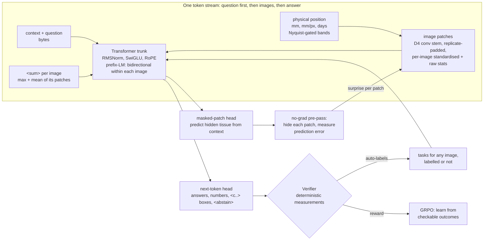

# General Pattern Model (GPM)

A from-scratch, general-purpose transformer for medical images and text.
**It has no classification head.** Every capability (detecting, locating,
measuring, counting, comparing timepoints, describing, declining to answer) is
a *prompt* with a *text answer*, and many answers can be checked by a
deterministic verifier.

Code: `oncopattern/gpm/`. Train: `python -m oncopattern gpm-train`. Plan compute: `python -m oncopattern gpm-plan`.



## Why this is not a classifier, and why it is built from scratch

| A classifier | GPM |
|---|---|
| Fixed output head with K classes | Text answers; a new task is a new prompt, not a new head |
| Needs a label per image | Learns from unlabelled images (masked-pattern modelling) and auto-labelled measurements |
| One image, one scale | Any number of images, any physical scale (0.25 um to mm per pixel), any timepoint |
| Says *what* | Says what, *where* (box tokens), *how much* (numbers), *compared with when* (time), or *I don't know* (`<abstain>`) |
| Output cannot be checked | Many outputs are verified against measurements, the way code is checked by tests |

The *generality* comes from the interface (everything is a token) and the
objective (predict hidden patches, generate answers), not from writing the
layers by hand. Existing pretrained models can be generalists too (see
Related work). This model is built from scratch because **the architecture is
the research question**. Only a from-scratch model at matched compute can show
which of these design choices matter.

## The analogy to code models, made precise

Code models are reliable because of two things:
1. **Grammar from huge unlabelled corpora.** The model knows what well-formed
   code looks like, so a bug is a *low-probability token*.
2. **Checkable output.** Compilers and unit tests give exact rewards (RL from
   verifiable rewards).

GPM's counterparts:

| Code model | GPM |
|---|---|
| Next-token prediction on code | Masked-patch prediction on tissue: learns the "grammar" of normal cell size, spacing, orientation, texture |
| A bug = a surprising token | An anomaly = a surprising patch: `model.patch_surprise()` hides each patch and measures how badly context predicts it |
| Compiler / unit tests | `gpm/verify.py`: boxes checked by IoU, numbers against deterministic measurements, classes against labels |
| Test-generated training data | `gpm/sources.py`: every image yields verifiable tasks (count nuclei, measure enlargement or misalignment, locate the strongest deviation), even without a diagnosis label |
| RL from verifiable rewards | `gpm/rl.py`: GRPO with verifier rewards, and a fixed reward for `<abstain>` |

## Components and equations

**Token stream.** `<bos> context question xN_1 <sum> [xN_2 <sum> ...] <sep> answer <eos>`.
Bytes for text (no vocabulary to learn, and numbers are digit-exact), 64
coordinate tokens `<c0>..<c63>` for boxes (edge-exact on a 64-grid), and
`<abstain>`. The question comes *before* the images, so patches are encoded
knowing what is being asked (task-conditioned reading), and each image's
`<sum>` token, a learned projection of the max and mean of its patch
embeddings, sits right before the answer.

**Patch stem (`d4conv`).** Two D4-equivariant convolution layers *inside* each
patch (replicate padding, so no fake edges at patch borders, and the D4
symmetry is exact), then max and mean pooling with orientation channels
kept. Pixels are standardised per image before the convolutions; raw
mean/std/max/min statistics are appended, so absolute intensity is not lost.
Convolutions never cross patch borders, so hidden patches cannot leak into
neighbours during masked-patch training. Alternatives kept for ablation:
`d4` (one orientation-shared filter bank) and `linear` (plain ViT).

**Physical position code.** For each patch, `phys = [y_mm, x_mm, z_mm,
log2(mm/px), t_days]`. Encoding: sin/cos at 16 wavelengths from 2 um to
0.5 m, plus log-scale and time bands (1 week to 10 years). **Nyquist-gated:**
a band shorter than twice the patch spacing is switched off for that patch,
because sampled on that grid it is pure aliasing noise. A slide keeps its
micrometre bands; an MRI keeps only centimetre and longer ones.

**Surprise conditioning.** A no-gradient pre-pass hides each patch once
(across `surprise_groups` passes) and measures how badly context predicts
it. That log-error, standardised with running statistics, is added back into
each patch token through a small MLP. The model's own "this does not fit"
signal becomes an input to its reasoning, the image analogue of a code
model noticing an unlikely token. A patch hidden for masked-patch training
gets neutral surprise, so nothing leaks (tested).

**Prefix-LM attention.** Allowed(i, j) = (j <= i) OR (same image). An image
has no reading order, so its patches attend both ways; text is causal.

**Objectives.** `L = CE(answer tokens) + lambda * MSE(hidden patch pixels)`.
The masked-patch examples need no labels. The two kinds of example are mixed
in each batch, one flag per example, in a single forward pass.

**Classification without a classifier.** `P(option | image, prompt)` =
softmax over sequence log-likelihoods of each option's text
(`evaluate.option_probs`). This works for *any* option list, including
unseen ones, and it feeds the conformal and selective-risk layer
(`calibration/conformal.py`).

**Abstention as a decision rule.** Reward `r = 1` if correct, `0` if wrong,
`r_a` for `<abstain>`. A policy that is right with probability p should answer
iff `p > r_a`. Setting `r_a = 1 - target accuracy on answered cases` aligns
RL training with the certified abstention used at deployment.

**GRPO.** For G samples per prompt: `A_i = (r_i - mean r)/std r`,
`L = -mean_i A_i log pi(a_i)/|a_i| + beta KL(pi || pi_ref)`, with log-probs of
the exact sampled token ids.

## Knowing what healthy looks like: the normative atlas (`gpm/normative.py`)

The model should know healthy anatomy in detail, say what is different in a
patient's scan, and show *why* that difference drives its answer. Three
parts do this:

1. **Normative training.** The masked-patch ("what fits here") objective sees
   **only healthy images**: the normal classes of labelled datasets (e.g.
   `notumor`, `lung_n`, BUSI images with empty masks) plus dedicated
   healthy cohorts via `healthy:<dir>` sources (IXI, OASIS-3 or HCP brains,
   GTEx normal tissue; see the catalogue tag `healthy_reference`).
   Question-answer training still uses every image. `--mixed-mim` turns
   this off for the ablation.
2. **Atlas.** On healthy scans the model never trained on (the `calib`
   split), measure how predictable each position is:
   `z_p = (log err_p - mu_p) / sd_p`, with per-position statistics shrunk
   toward global ones. The highlight threshold is the 99.5th percentile of
   z on held-out healthy scans, so it flags about 0.5% of healthy patches by
   construction. The report also gives the scan's percentile among healthy
   references.
3. **Healthy counterfactual and causal explanation.** Flagged patches are
   redrawn as the model expects healthy tissue to look, given *this
   patient's* surrounding anatomy. The question is asked again on the
   redrawn scan; the drop in the answer's probability is each region's causal
   effect on the answer. The report shows four panels: the scan, deviation
   from healthy, the model's healthy version, and the difference.

```
python -m oncopattern gpm-atlas   --model model.pt --source "folder:.../Training,modality=mri,mm=0.5" --out brain_atlas.pt
python -m oncopattern gpm-explain scan.png --model model.pt --atlas brain_atlas.pt \
       --question "Is there a tumour? Answer yes or no." --options "yes|no" --modality mri --mm-per-px 0.5
```

Data splits for real datasets are by file-name hash: train 80%, calib 10%
(atlas only; never trained on), test 10% (final numbers only).

**Hypothesis H8 (normative training):** learning "what fits" from healthy
scans only makes deviations easier to detect and localise than learning it
from all scans. `experiments/normative_ablation.py` tests this at matched
compute; results are below.

**Results (tiny preset, 1,500 steps each, MRI phantoms, single seed; raw numbers in
`docs/examples/normative_ablation.json`):**

| | "What fits" learned from healthy scans only | ... from all scans |
|---|---|---|
| Lesion vs healthy scan, from deviation alone (AUROC, no labels used) | 0.89 | 0.88 |
| Deviation points at lesion pixels (patch AUROC vs masks) | 0.90 | 0.89 |
| Lesions with a highlighted region on them | 95% | 95% |
| Drop in P("yes, lesion") when highlighted regions are redrawn as healthy | **90 points** | 70 points |
| Falsely highlighted patches per healthy scan (of 64) | 1.5 | 1.05 |

Reading: detection and localisation are the **same** either way at this
scale. The difference is the *explanation*: a model that learned "what fits"
from scans containing tumours partly redraws the tumour when asked for a
healthy version, so the counterfactual removes less of the reason. An
earlier variant without region growing showed 70 versus 10 points, but most
of that gap came from highlights covering only the lesion core, not from
training. Region growing (hysteresis) fixed coverage at the cost of more
false highlighted patches. One seed on phantoms: promising, not
established. Example reports: `docs/examples/gpm_normative_explanation_lesion.html`
(P("yes") 100% → 0.2% when the region is redrawn healthy) and `..._healthy.html`.
In the lesion example the grown region also reaches the skull edge, and the
model's redraw of the skull is blurred, so part of the "difference" panel
there is redraw error rather than abnormality.

**Limits.** "Healthy" means "like the reference set": a biased reference set
(one scanner, one age group) gives a biased atlas. Positions are grid
positions, so references and patients need a roughly common frame; proper
registration to an anatomical template (e.g. MNI space for brains) is on the
roadmap. A counterfactual is the model's belief about healthy tissue, not
ground truth.

## What we learned debugging it (measured, and worth reporting)

The first version could not learn "is there a mass lesion?" on MRI
phantoms (chance, 43%), while a two-layer CNN reached 98% in 150 steps.
Linear probes and signal budgets traced four root causes, each fixed at
the design level:

| Symptom | Measurement | Cause | Fix |
|---|---|---|---|
| Content swamped | across-patch variance: content 0.0018 vs position 0.0097; stem gradient 20x smaller | micrometre Fourier bands aliased on a 24 mm patch grid | Nyquist-gated position bands |
| Local contrast invisible | raw top-50 pixels probe 99%, stem features 54% | one linear map per patch cannot see blob-versus-surround | D4 conv stem + raw intensity stats |
| Fake edges | none on a black background, strong on bright tissue | zero padding inside each patch | replicate padding (still exactly D4-equivariant) |
| Answer ignores image | spread of answer-position states 0.0176 → 0.0001 during training; image variation 0.002 vs fixed parts 0.02 | image signal 10x smaller than constant token parts, so the base-rate answer wins and states collapse | per-image standardisation, fan-in init, question-first order |

After the fixes: 83% held-out on the lesion question after 500 steps
(from 43%). Two confounds in my own diagnostic scripts (no warmup or
gradient clipping) were ruled out along the way. With the real training
recipe the plateau on easy tasks breaks in under 50 steps on every seed.

## First measured results

Tiny preset (2.0M parameters), 3,000 steps x 16 examples on a laptop CPU,
mixed tissue and MRI phantom tasks with 30% masked-patch examples; 40
held-out examples per task. "Baseline" is the best constant answer.
Raw numbers are in `docs/examples/gpm_tiny_cpu_eval.json`.

| Task | First version | After the four fixes | Baseline |
|---|---|---|---|
| MRI lesion yes/no | 0.43 | **1.00** | 0.53 |
| MRI growth between two scans | 0.50 | **0.85** | 0.55 |
| MRI lesion box (IoU reward) | 0.43 | **0.61** | 0.48 |
| Tissue pattern (4-way, single-cell) | 0.23 | 0.18 | 0.38 |
| Tissue normal / locate / describe / count | at baseline | at baseline | |
| Surprise AUROC (image, tissue, no labels) | 0.86 | 0.85 | 0.50 |

Single-cell tissue patterns are the open problem for GPM. They are also
the core of the cancer use case, so they are the first thing the Kaggle
`base` run must answer. A short GRPO phase (40 updates, lr 5e-5) moved
held-out rewards by less than 0.03, which is too little to claim anything.

## Sizes and what your compute can train

| preset | params | where |
|---|---|---|
| tiny | 2.0M | CPU; tests and debugging |
| small | 15.0M | 1x T4, hours |
| base | 87.7M | **Kaggle 2x T4, 30 h/week (recommended)** |
| 1b | 0.92B | A100/H100-class |
| 7b | 7.15B | multi-node, sharded (FSDP); billions of image tokens |

Counts are exact (`compute.count_params`, meta device). Kaggle budget (2x T4,
30 h, 30% utilisation): about 4.2e18 FLOPs, so the compute-optimal size is
about 190M parameters. With only PCam-sized data (~35M unique tokens), the
optimum drops to about 7M: **on Kaggle you are limited by data, not by the
architecture**. Mix several datasets. Verifier-generated tasks add
supervision per image, but not new images.

Why not 7B on Kaggle: training in mixed precision needs about 16 bytes per
parameter, 112 GB for 7B, before activations. A T4 has 16 GB. Even with
enough memory, 30 T4-hours would give 7B about 0.1B tokens, roughly 1/1400 of
what it needs. The same code runs the 7b preset unchanged when you have the
hardware.

## Kaggle workflow

See [`kaggle/README.md`](../kaggle/README.md): clone, pick datasets, run
`kaggle/kaggle_train.py`, save the version, attach its output next session to
resume.

## Research plan (what a paper would need)

**Hypotheses, each testable with matched compute:**
- **H1 (physical scale):** physical-position encoding beats plain patch-index
  positions when training mixes magnifications and modalities, and it
  transfers to an unseen magnification. *Ablation:* `phys` versus index positions.
- **H2 (verifier supervision):** auto-labelled measurement tasks improve
  label efficiency on downstream diagnosis. *Ablation:* with or without
  verifier tasks, at 1%, 10% and 100% of labels.
- **H3 (surprise):** masked-patch surprise localises lesions without any
  lesion labels (patch AUROC against masks: BUSI, Camelyon16 annotations).
- **H4 (orientation sharing):** the D4 conv stem improves data efficiency on
  histology. *Ablation:* `stem=d4conv` versus `d4` versus `linear`.
- **H6 (surprise conditioning):** feeding the model's own masked-prediction
  error back into its tokens improves detection of local anomalies at equal
  compute. *Ablation:* `surprise_conditioning` on or off. It costs about 1.7x
  compute per step at 2 groups.
- **H7 (question-first reading):** question-before-image order speeds up
  learning and avoids answer-position collapse. *Ablation:* token order.
- **H5 (abstention):** GRPO with an abstention reward yields selective
  accuracy at matched coverage that beats supervised training plus confidence
  thresholding.

**Baselines:** a ViT or MAE of the same size and compute, trained from
scratch; linear probes on public pathology encoders (UNI, CONCH) as an upper
reference; published numbers on PCam and Camelyon16.

**Datasets reachable from Kaggle:** PCam (histopathologic-cancer-detection),
LC25000 (lung and colon histology), Brain Tumor MRI, BUSI (ultrasound with
masks), CBIS-DDSM (mammography). Report each separately *and* a held-out
dataset the model never trained on.

**Reporting:** mean and 95% CI over at least 3 seeds; compute (GPU-hours)
for every run; failure analysis with `loop/failures.py`.

### Related work (checked September 2026; verify before citing)
- Generalist medical models: [RadFM](https://www.nature.com/articles/s41467-025-62385-7),
  [MerMED-FM](https://pubmed.ncbi.nlm.nih.gov/42509078/), [Lingshu](https://arxiv.org/pdf/2506.07044),
  [Harrison.Rad 1.5](https://arxiv.org/pdf/2607.05880).
- Pathology foundation models: UNI, Virchow2, Prov-GigaPath ([comparison](https://arxiv.org/html/2506.05184v1)),
  [TITAN](https://www.nature.com/articles/s41591-025-03982-3).
- Verifiable rewards for medical VLMs: [MedMO](https://arxiv.org/pdf/2602.06965) (bounding-box rewards);
  [grounding audit](https://arxiv.org/html/2603.03437) (38-43% of visual claims ungrounded).
- Conformal abstention and evidence acquisition: [BCEA](https://arxiv.org/abs/2606.16667).
- Normative "knows normal" pretraining: [BrainNorm](https://arxiv.org/html/2608.17521).

**Honest novelty statement.** Each ingredient has precedent. What may be new,
subject to a proper literature review, is the *combination*: physical-unit
positions spanning cells to organs in one token stream, verifier-generated
measurement tasks as label-free supervision, surprise-based localisation
from the same model, and an abstention reward tied to a certified
selective-risk target. The claim has to be earned by the ablations above.

**Authorship.** AI tools cannot be listed as authors, and most venues require
disclosure of AI assistance. The experiments, analysis and claims need to be
the authors' own.
